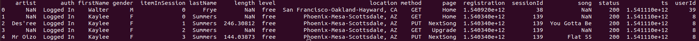
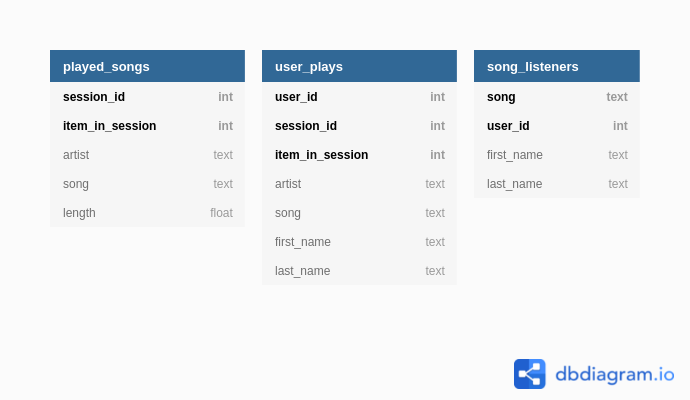

## Sparkify data modeling with Apache Cassandra

### About the project
In this project, data from a fictive streaming music company "Sparkify" is 
processed and written to an Apache Cassandra database. The Cassandra 
database hereby enables easy querying of the data for analysis purposes. This project is part of the Udacity nanodegree 
Data Engineering.

### Overview

The project contains two python scripts, being:

- **main.py**, containing all functions for performing the necessary ETL's 
  and querying the data, including functions for creating a new database schema 
  and tables and functions for selectively extracting song play data and 
  writing said data to the database tables; and
- **cql_queries.py**, containing all the CQL queries performed on the 
  database engine.
  
Moreover, the project contains a Jupyter Notebook - **project_notebook.
ipynb** - which in the basis has the same functionality as the *main.py* and 
*cql_queries.py* files. For running instructions, please see below under 
"Making use of the Jupyter notebook".

### Description of the dataset

The repo provides a sample dataset for interaction with the scripts. This 
dataset can be found in the *event_data* directory.

The dataset consists of songplay event data, wherein the data for each day 
is contained in a separate file in CSV format. To get a feel for the data 
format, a sample of the data is given below.



### Queries and data model

The data in the Apache Cassandra database is modelled to fit the type of 
queries that are run against the database. The type of queries run against the 
database are:

1. Give me the artist, song title and song's length in the music app 
   history that was heard during sessionId = #, and itemInSession = #.
   
2. Give me only the following: name of artist, song (sorted by itemInSession)
   and user (first and last name) for userid = #, sessionid = #.
   
3. Give me every user name (first and last) in my music app history who 
   listened to the song #.
   
Consequently, the data model for the database looks as follows:



### Running instructions

To get a local environment running in which to create the ETL pipelines and 
query the database, go through the following steps:

1. Clone the repository into the working directory and move into the project
   directory:
   ```
   git clone https://github.com/bastiaanhoeben/sparkify-cassandra.git
   ```
   ```
   cd sparkify
   ```   
   
2. Start up the Cassandra database service in the background:
   ```
   docker-compose up -d
   ```
   
3. Create a virtual environment and activate it:
   ```
   python3 -m venv .venv
   ```
   ```
   source .venv/bin/activate
   ```
   
4. Install the necessary packages from requirements.txt:
   ```
   python -m pip install -r requirements.txt
   ```

5. Run the piplines and query the database with the *main.py* script:
   ```
   python main.py
   ```


### Making use of the Jupyter notebook

The database can be populated without the use of the notebook. For a proper 
functioning of the notebook, Jupyter Notebook must run *inside* the virtual 
environment. An easy way to achieve this is by installing Jupyter Notebook 
within the activate venv like so:
```
pip install notebook
```

The notebook can then be started easily through:
```
jupyter notebook project_template.ipynb
```